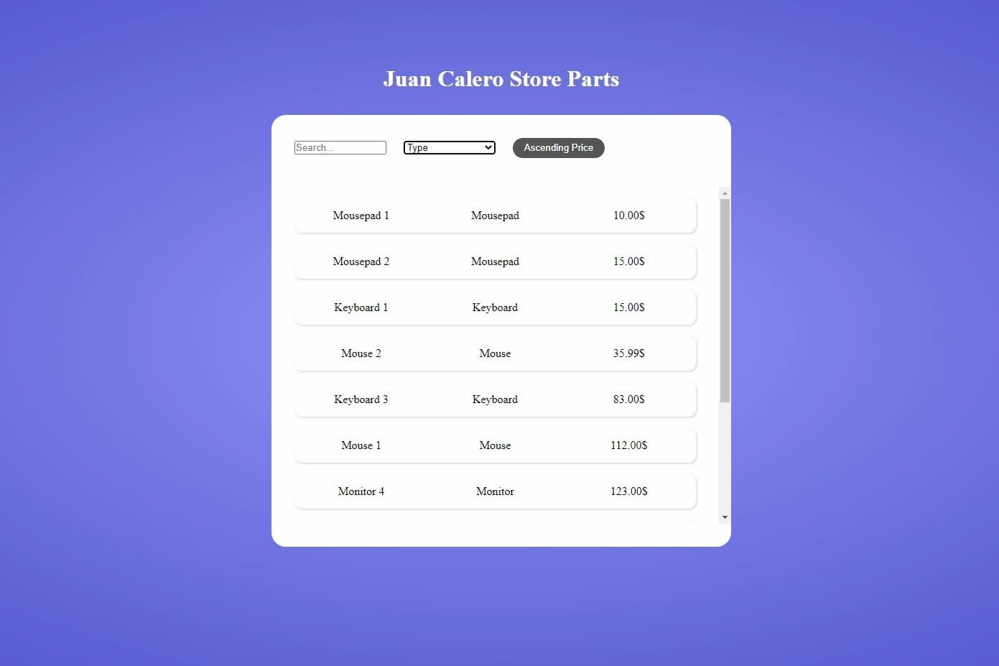
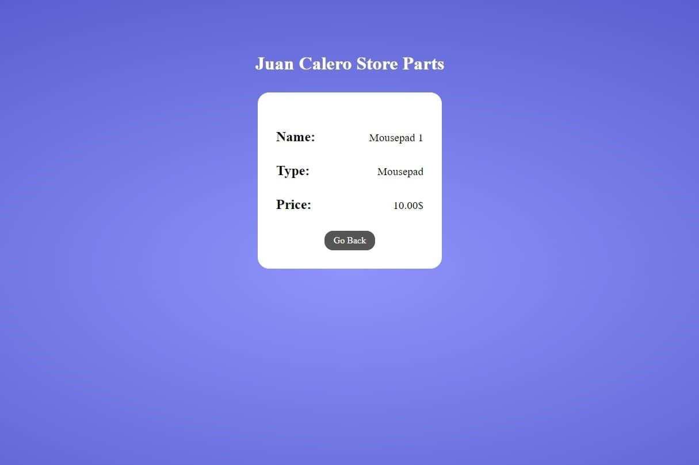

# STORE-PARTS-EXERCISE

Hello and welcome! This project is my solution to Mozantech's recruitment challenge "store-parts-exercise", built using the React Framework.

## Goal

The main goal of the exercise is to build a Single Page Application to extend an API.

Requirements Met:

- Two different routes ☑
- The possibility to order by price implemented on the SPA side ☑
- A way to request different parts by type ☑
- The ability to request different search queries on typing ☑
- Create a public repo to share your work with us ☑
- An accurate README to show us how to run your app ☑
- You should not change this service ☑

What we value:

- Static typing ☑
- Eslint ☑
- Unit tests ☑
- Your unique skills ☑

Extra Features:

- "Order by price" button, type of parts and Search queries are all implemented on SPA side, and automatically update the parts without the need to submit (e.g. no need to press ENTER).
- Dynamically generated Product Page, accessible upon product click.
- "Go Back" button on product page, to return to the main page.

Hope you Like it! (っ＾ ▿ ＾)っ

#### Main page



#### Parts page



## Tech Used

I developed this project using React.js and SASS, and used Jest, Enzyme and react-testing-library for testing.

## API Documentation

To run the API you will need to:

1. Install the dependencies
2. Start the server (wich will start on port `8081`)
3. On a separate terminal, run the react app (wich will start on port `3000` and should pop up on a new browser window)

WARNING: You need to start the server on a different terminal than the react app, otherwise React won't have anything to fetch!

Yarn:

```
yarn install
yarn run server
```

then, on a different terminal:

```
yarn run start
```

or

NPM:

```
npm install
npm run server
```

then, on a different terminal:

```
npm run start
```

Endpoints on port `8081`:

- `/store/parts` to get all the parts.
- `/store/part-types` to get the part types.
